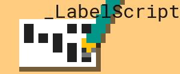

Welcome to **LabelScript**, an Untangled 2016 project utilising a Dymo LabelWriter 400 to create an implementation of a 'Logo' like language using JavaScript and a camera.

# Features

- **Web based editor** 
Web based editor that allows a user to create a program Labelscript and print it out.

- **Labelscript importer**
A camera system that reads in Labelscript and converts it.

- **Labelscript interpreter**
An interpreter that will execute the imported labelscript code

# Team Members

- **Harry**
- **Ben**
- **Nat**

# Equipment

- **Raspberry Pi**
- **Camera**
- **Stepper**
- **Dymo LabelWriter 400**
- **Dymo 99012 Labels**
- **Linux server**
